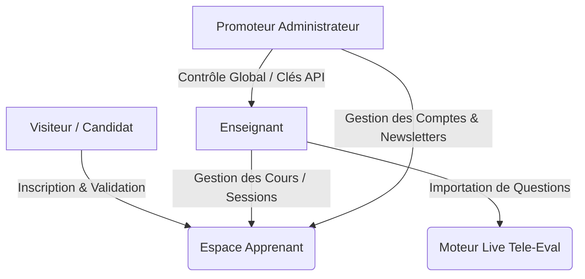
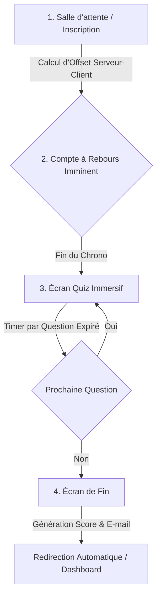
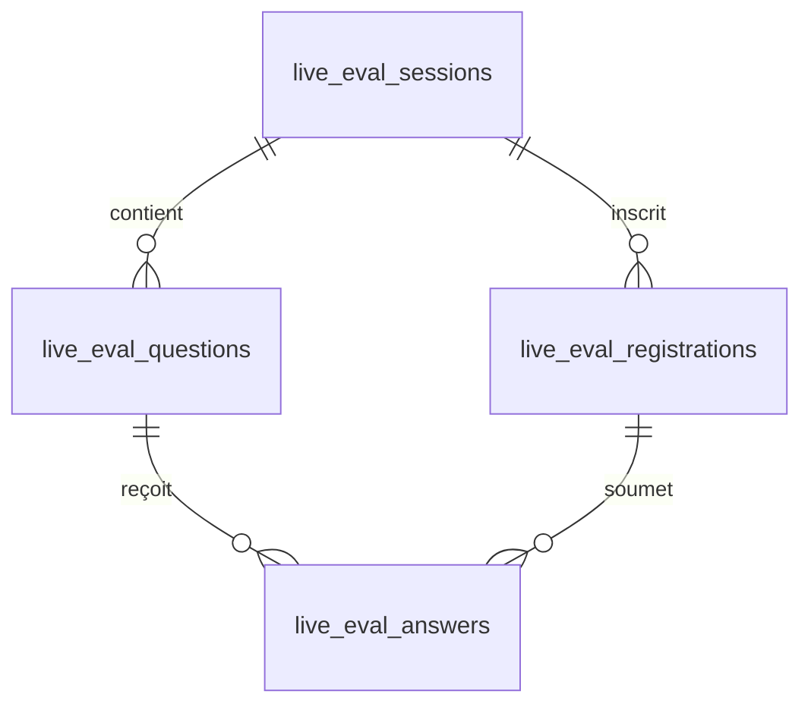

# 🎓 StudyVibe LMS — Enterprise Learning & Live Tele-Evaluation

> **Un système moderne d'apprentissage et d'évaluation synchrone à haute performance.**  
> *Conçu pour l'excellence académique, l'immersion sans distraction, et les certifications automatisées.*

---

## 🌟 Philosophie & Concept

**StudyVibe** est un Learning Management System (LMS) moderne et hautement sécurisé, optimisé pour les établissements scolaires, universités et centres de formation continue. Contrairement aux plateformes classiques passives, StudyVibe intègre :

1. **Un apprentissage immersif et guidé (Content Gating)** : Les étudiants progressent à leur rythme à travers des leçons enrichies (textes, vidéos interactives, documents PDF), avec un déverrouillage automatique et conditionnel des quiz.
2. **Une évaluation synchrone en temps réel (Live Tele-Evaluation)** : Un moteur innovant permettant de lancer des sessions d'examens simultanées pour des promotions entières (40 à 60+ étudiants connectés en direct), synchronisés à la seconde près sur l'horloge absolue du serveur.
3. **Des certifications automatisées** : Génération et vérification instantanée de diplômes sécurisés au format PDF avec signatures numériques uniques et codes de vérification publics.

---

## 🚀 Fonctionnalités Clés par Espace



### 👤 Espace Apprenant (Student Hub)
* **Tableau de Bord Premium** : Vue d'ensemble avec statistiques clés en main (taux de réussite, temps cumulé d'étude, badges de progression).
* **Liseuse Universelle Zen** : Lecture conjointe de leçons textuelles, vidéos YouTube intégrées et documents PDF (via un visualiseur fluide basé sur **PDF.js**).
* **Notes de Cours Calées sur le Temps** : Capacité pour l'étudiant d'ajouter des notes personnelles directement associées à un timestamp spécifique de la vidéo de cours.
* **Assistant IA WhatsApp-Style** : Un tiroir de chat conversationnel intelligent intégré au cours pour générer des résumés, demander des explications ou s'auto-évaluer.

### 🍎 Espace Enseignant (Teacher Space)
* **Création de Contenu Structuré** : Publication de cours divisés en chapitres et leçons.
* **Gestionnaire de Sessions Live** : Planification de séances de téléévaluation synchrone avec contrôle d'activation immédiat.
* **Moteur d'Importation Intelligent** : Ajout de dizaines de questions à partir de fichiers de données CSV/JSON en un clic.
* **Modération interactive** : Réponses aux questions des étudiants sous les leçons et modération des commentaires en direct.
* **Suivi de Notes & Exports** : Analyse des courbes de réussite des étudiants et export de rapports détaillés aux formats Excel (via un exportateur optimisé) ou PDF.

### 👑 Espace Promoteur (Promoter Console)
* **Contrôle d'Accès Multi-Rôles** : Création et désactivation des comptes enseignants et étudiants.
* **Gestionnaire de Certificats** : Émission manuelle ou automatique de certificats de réussite avec validation publique par code unique.
* **Broadcaster de Newsletters** : Envoi ciblé de mails d'information ou de suivi de cours avec système de désinscription conforme au RGPD.
* **Développeur API Keys** : Génération et révocation de jetons d'accès API pour connecter StudyVibe à des systèmes d'information tiers (Scolarité, ERP).

---

## ⏱️ Moteur de Téléévaluation Synchrone

La force majeure de la version actuelle réside dans son protocole de synchronisation temps réel sans WebSocket requis, garantissant légèreté et haute résistance aux fortes charges.

### Fonctionnement du flux synchrone :


1. **Calcul de Dérive Temporelle (ServerTimeOffset)** : Pour contrer les latences réseaux et tricheries sur l'heure locale, le client calcule un offset par rapport à l'heure universelle du serveur lors de son premier chargement.
2. **Salle d'Attente Interactive** : Les étudiants non-inscrits remplissent leur nom et e-mail (sans compte requis) tandis qu'un chrono géant décompte le temps restant avant le début de l'épreuve.
3. **Quiz Immersif sans distraction** : Au top départ, la page passe en mode focus plein écran. Les questions défilent automatiquement à la fin de leur temps imparti respectif. Les réponses sélectionnées sont envoyées instantanément et les options d'interaction sont figées en attente du changement de question.
4. **Calcul de Score Côté Serveur & Notification** : Dès le dernier chrono écoulé, le serveur calcule la note globale, valide les résultats et envoie automatiquement par mail la fiche complète des notes à l'apprenant.
5. **Redirection Intelligente** : Un minuteur de 30 secondes s'affiche à la fin, redirigeant les étudiants inscrits vers leur espace personnel et les candidats invités vers la page d'accueil de la plateforme.

---

## 🛠️ Stack Technique & Architecture

* **Backend** : PHP 8.3+ avec typage strict activé (`declare(strict_types=1)`), base de données relationnelle MySQL (PDO).
* **Frontend** : CSS3 pur hautement stylisé (thème premium crème & vert émeraude, mode sombre natif), Vanilla JavaScript moderne orienté composants.
* **Sécurité des Sessions** : Protection contre les attaques CSRF via l'en-tête de cookie `SameSite=Strict`. Protection anti-brute-force par limitation du nombre de requêtes (`login_attempts` par IP/Email) et journal d'audit complet (`audit_logs`).
* **Timezone Standardisée** : Fuseau horaire calé globalement sur `'Africa/Douala'` (WAT / UTC+1) pour assurer la cohérence entre les dates de bases de données et l'heure système des serveurs PHP (notamment pour Railway, Render, etc.).

### Modèle de Données (Moteur de Téléévaluation)



---

## 🏫 Applications Académiques & Pédagogiques

StudyVibe s'adapte à de multiples cas d'usages réels :

* **Examens de Fin de Cycle Universitaire** : Passage simultané de QCM certificatifs à distance ou en présentiel dans des salles machines, avec synchronisation centralisée par le professeur.
* **Licensing & Formations Professionnelles** : Inscription simplifiée par simple lien temporaire. Les candidats externes passent l'épreuve et reçoivent instantanément leur score et certification par email sans polluer la base de comptes de l'école.
* **Classes Inversées (Blended Learning)** : Lecture de vidéos de cours à la maison avec prise de note indexée, suivie d'un QCM de validation de présence et de compréhension.

---

## 🔮 Évolutions Futures & Roadmap

> [!NOTE]
> La plateforme est conçue de manière modulaire pour accueillir facilement de nouvelles briques logicielles.

- [ ] **Moteur WebSockets (Node.js/Mercure)** : Transition optionnelle vers un canal de push bidirectionnel pour réduire la charge de polling HTTP lors de pics de plus de 1000 étudiants simultanés.
- [ ] **Détection de Triche Avancée** : Suivi de la perte de focus de l'onglet du navigateur (Tab-switching / Page-leave telemetry) avec avertissements et disqualification automatique de la session live.
- [ ] **AI-Proctoring (Surveillance WebCam)** : Analyse de présence faciale assistée par IA locale pour s'assurer que le candidat inscrit est bien celui devant son écran tout au long du quiz.
- [ ] **Générateur Automatique de Questions par IA** : Analyse automatique des cours PDF téléversés par l'enseignant pour générer des banques de questions d'examen en un clic.
- [ ] **Exports Statistiques Avancés** : Intégration de graphiques de distribution de notes (courbe de Gauss) et de taux d'échec par question directement sur le dashboard enseignant.

---

## ⚙️ Configuration & Déploiement

### Variables d'environnement requises (`.env`)
```env
DB_HOST=127.0.0.1
DB_NAME=studyvibe
DB_USER=root
DB_PASS=votre_mot_de_passe

MAIL_HOST=smtp.gmail.com
MAIL_PORT=587
MAIL_USER=votre_adresse_mail
MAIL_PASS=votre_mot_de_passe_application
MAIL_FROM=noreply@studyvibe.com
MAIL_FROM_NAME=StudyVibe

APP_URL=https://studyvibe.railway.internal
APP_ENV=production
```

### Installation Locale
1. Clonez le dépôt dans votre répertoire web.
2. Copiez le fichier `.env.example` vers `.env` et ajustez vos paramètres de connexion de base de données et de serveur SMTP.
3. Importez les schémas SQL dans l'ordre d'apparition (`schema.sql` puis les migrations de `schema_v2` à `schema_live_evaluation.sql`).
4. Lancez `composer install` si vous mettez à jour les dépendances de messagerie.
5. Accédez à la plateforme via votre serveur web local (ex: `http://localhost:8000`).

---
*Développé avec passion pour l'avenir de l'éducation en ligne. Version 2.4-stable.*
